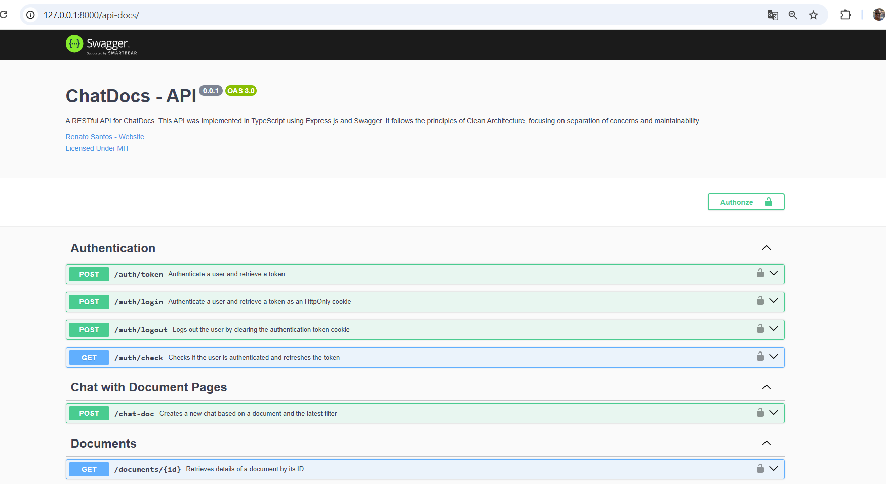
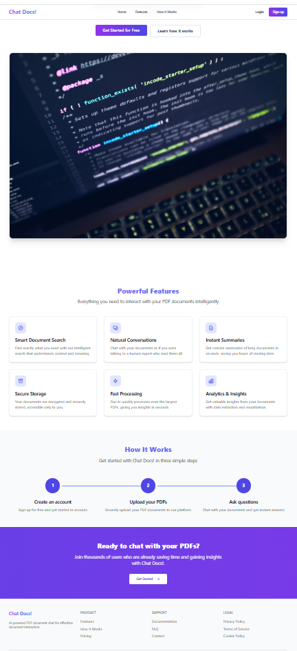
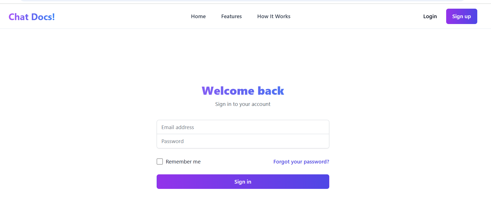
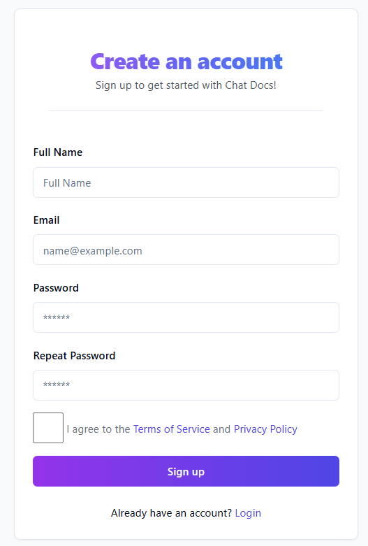
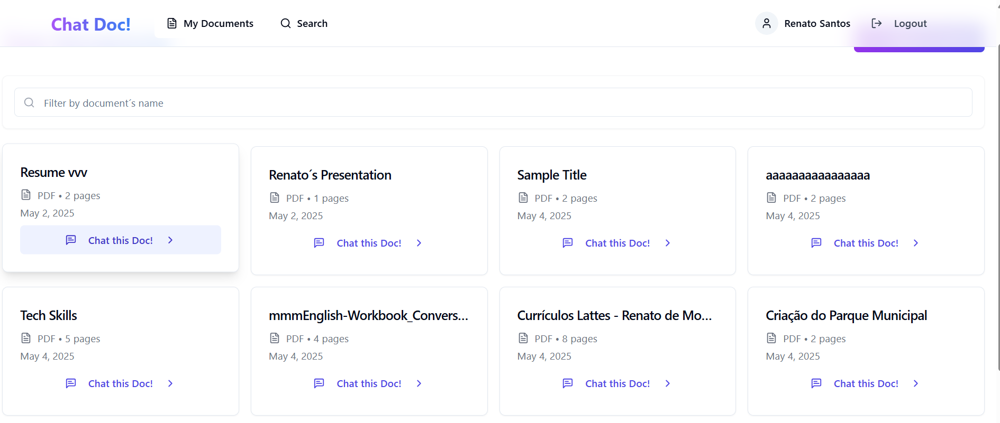
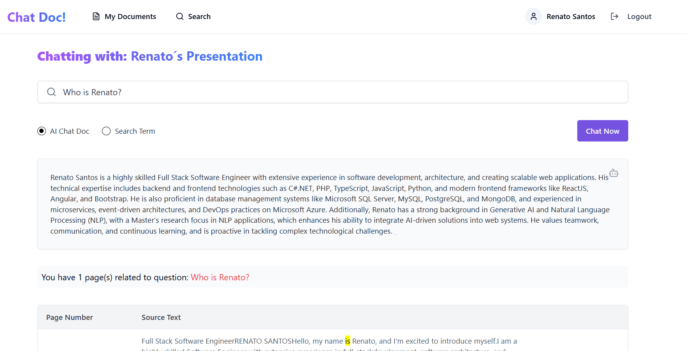
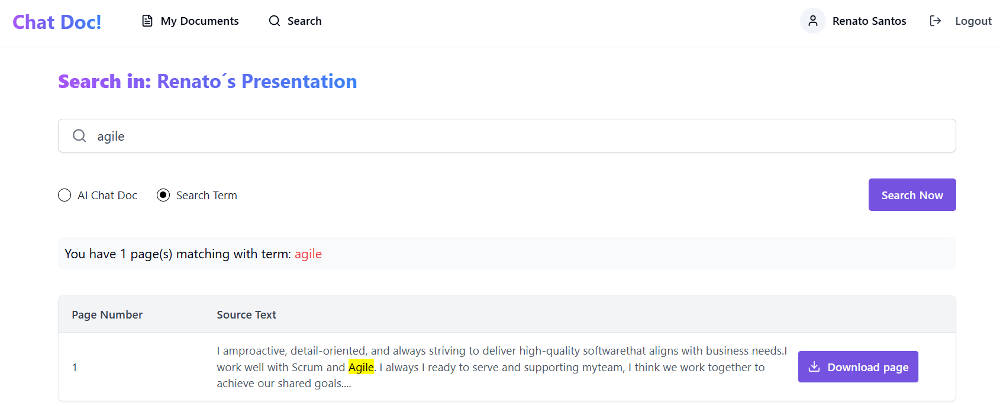
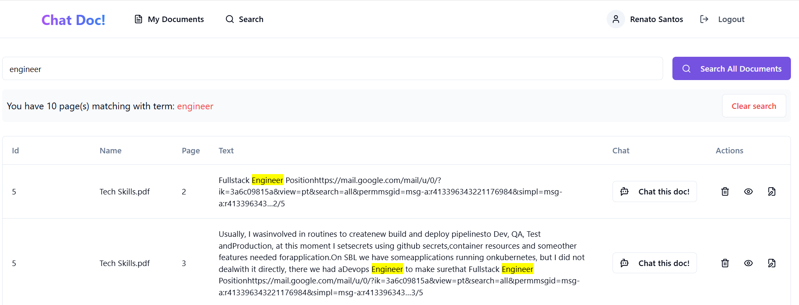

# Chat - Docs
This project aims to provider an easy and friendly Ai-Driven application to manager files and chat with them.

Chat Doc! becomes Chat Docs! Guru a commercial freemon web application, please go to https://chatdocs.guru/

If you need more information about Chat Docs! Guru restful api [click here](https://api.chatdocs.guru/api-docs/).

To discuss how I implemented it, please call me on:
 - https://www.linkedin.com/in/renato-santos-ti/ or 
 - https://calendly.com/renatosantos-ti

# Chat - Docs!

### Chat with your PDF documents using AI superpowers

This Chat - Docs! RESTFul API was developed based on my another project called TS-Clean-Archicteture-Rest-API-Boilerplate, following a
clean code strategy, some enhancements were done on that new project.

You are welcome to colaborate on TS-Clean-Archicteture-Rest-API-Boilerplate - https://github.com/renatosantosti/TS-Clean-Architecture-Rest-APi-Boilerplate

### Stack applied on this project:

- TypeScript
- Express
- Swagger
- Swagger-UI-Express
- Swagger-JSDoc
- TSoa
- Morgan
- JWT
- BCrypt
- DotEnv
- Docker
- Jest
- Sqlite - mocked database

### AI Driven Stack:

- OpenAI API - to generate vector db embedding and to create insights and finds during chat conversation
- Elastic Search - for index document pages and semantic search - vector database was used to.
- Kibana - used as UI to manage Elastic Search

### MVP

Here I will present main goals and backlogs that could be implemented on the future.

### Functional Requirements (user stories)

- As user I need to sign-in and sign-out on ChatDocs.com
- As non user I need to create my account and set my image avatar
- As user I want to edit my profile, reset my password and change my avatar image
- As user I need to upload my documents and set its properties(details)
- As user my documents will be available only to my account
- As user I need to search term and find all documents have those terms
- As user I can preview document sumarry before chat this document
- As user I want o chat with a specific document - so I could ask somethinng about document context or ask for conclusions and etc.
- As user I want o chat with a specific document - so I could ask something about document context or ask for conclusions and etc.

- When I am chatting with document, as an user I want search for terms and found all pages that have that term.

A wireframe was create to clarify that app behavior. It´s wireframe with first concept of this app, some stuffs are litle bit different on real application - [Click here](https://excalidraw.com/)

Also here you can see that wrireframe: [concept](documentation/about-concept.md) or [click here](documentation/image.png)

### Non-Functional Requirements

- For that moment only .pdf files can be uploaded
- Authorization access by JWT token
- Only authenticaded users can access app and manage documents
- AI api should be agnositic and shift by another easily
- Documents should storage on no-relational database and /or cloud storage instead hard-disk
- Documents should be pre-processed and indexed to quick search term or AI works
- Vector Databases should be used to delivery semantic search and avoid use AI for non-terms searchs
- Implement core business api and microservices on server-to-server communication instead monolith application server
- On frontend should be used React with UI framework such as ReactTrap or MUI,
- Unit test should be applied for each uses cases, repositories, services and controllers
- Integration tests should assure all services can work together
- Ever as possible apply UI unit test
- Use typescript instead pure(simple) JS on React(Frontend) or NodeJS(API)
- For AI services that consume external resources - AI provider could be a Python miroservices using FastAPI to provider rest api or 3rd partners, e.g: HuggingFace API, Anthropic, OpenAI/ChatGPT and etc.
- ORM should be used to access database on agnostic mode for NodeJS use Sequelize and for Python use SQL Alckmin
- Perfomance test must assure upload files less 1 minute, each search should be less 10 seconds and AI responses less 2 minutes.

### Backlog:

- As user I want to choose a folder for new uploaded document
- As user I need to choose document list as folder or as gridview as well (view mode)
- As user I want to create folder as move document to my folders
- As user when I am within folder I want to delete document when I press delete key
- As user I want to rename documents as I rename it on Windows 11 Folder
- As user I need to star (favourite) certain documents and filter stared documents
- As user I want to see history from my conversation with each document
- As user I want create annotation for document pages and see it any time or delete it
- As user I want upload other document format such as .doc, .dock, .pptx and .txt
- As manager user i need dispacher ai requests for diferents provider to optmize my budget to this project - so, on demand I can route ai request to cheaper services by one click (on system setup - admin)
- **AI-Driven**:
  - Auto tag my documents ( as user I can tag it manually as well or edit tags)
  - Auto insights generated on background accordinally document´s content, tags and previous interaction
  - As user I want save each ai generated insight that got useful
  - As budget managed - want save money processing insights, reindexing and any another background resourcing on batch mode and onother more cheaper time/timezone or AI provider
  - As budget manager- I want save money processing insights, re-indexing documents or another background resourcing on batch mode, also certain AI background resource could be proccessed on bach mode, midnight out or another cheaper provider - schedulled process could implemented here or task could be queued to be processed on bach mode.

#### Solution Design

The software design was develop to maximize flexility to change any component as required without side-effect another parts of system - loose coupling.


Some S.O.L.I.D principles were implemented and also clean Architecture foundations, those approach ensure separation of concerns, scalability, and ease of maintenance. Below is the proposed folder structure:

```plaintext
tests/
├── unit/                       # All unit tests
├── integration/                # All integration tests

src/
├── application/                # Application Layer
│   ├── interfaces/             # Interfaces for external systems
│   ├── services/               # Business logic services
│   ├── usecases/               # Specific use cases
├── config/                     # Configuration files
├── domain/                     # Domain Layer
│   ├── dtos/                   # Data Transfer Objects (DTOs)
│   ├── models/                 # Models or Entities
├── infrastructure/             # Infrastructure Layer
│   ├── mappers/                # Data mappers
│   ├── persistence/            # Database or storage-related code
│   ├── external-services/      # External API integrations
├── presentation/               # Presentation Layer
│   ├── controllers/            # Controllers for handling requests
│   ├── helpers/                # Utilities for presentation layer
│   ├── http-middlewares/       # HTTP-related middlewares
│   ├── routes/                 # Route definitions
│       └── auth/
│   └── views/                  # (Optional) Views or templates (if using a server-side rendered app)
├── shared/                     # Shared utilities, constants, or helpers
├── types/                      # Global TypeScript type definitions
└── index.ts                    # Main entry point
```

#### Folder Details

### Folder ./tests

Contains all tests spec.

### Folder ./src

- **application/**: Contains the application layer logic, including interfaces, services, and use cases that interact with the `domain` layer.
- **config/**: Holds configuration files, such as environment settings or constants.
- **domain/**: Includes the core business logic of the application, such as entities (`models`) and data transfer objects (`dtos`).
- **infrastructure/**: Manages external dependencies, such as data mappers, database connections, and third-party services.
- **presentation/**: Handles the application’s presentation logic, including request controllers, routes, and helpers for HTTP communication.
- **shared/**: Contains utilities or constants shared across multiple layers.
- **types/**: Stores global TypeScript type definitions for type-checking consistency.
- **index.ts**: The main entry point of the application.

#### Benefits of Clean Architecture

1. **Separation of Concerns**:

   - Each layer is responsible for a specific functionality, making the code easier to maintain and extend.

2. **Scalability**:

   - You can add new features or modules without affecting other parts of the system.

3. **Testability**:

   - The decoupled design allows independent testing of each layer.

4. **Code Readability**:
   - Well-organized structure improves developer understanding and onboarding.

## Features

- Manage Users
- Manage Auth & JWT Token generate - exception refresh token yet
- Manage documents & pages
- Index Document on Elastic by text´s terms and semantically via Vector Embeddings
- Search by terms
- Search semantincally
- Chat with document - AI Driven Resource
- Avoid chatting something out of document´s context

## Low coupling and high cohesion

- Applied S.O.L.I.D principles and Clean Archicteture
- Any dependencies could be replaced by another implementations
- External resources could be replaced easily
- Services and adapter can be moved out this solution as microservice since interface had been implemented and resource injected.
- Inversion of control was archive by container injection, so all resouce are injected on container and shared with app to injected/resolved when it is required;
- Singleton: some resource had a singleton instance to be injected as required
- Cohension: all application flow from domain & core application, also single responsability principle was followed to assure high cohension and easy manuntenability

## Tests and test converage

- All application is ready to 100% test coverage
- Some unit test was implementes as proof of abilities

## Docker and Containerization

- All services are ready to be containerized and deployed on one click
- State less principle was implemented on each rest end-point
- API and UI are ready to be scalable horizontally once app do not depends on disk, memory state or any else.

#### More information about API

- [Full Core API Documentation](core-api/README.md)
- For a full end-point documentation, please start Rest API and read OpenAPI documentation made over Swagger.

Attention: only POST: /auth and POST:/user don´t require token.
To generate token, use POST: /auth next apply your new token on Swagger Autorize Botton


Swagger Preview


## UI Resources

App frontend was implemented as beatyfull and friendly user interfaces. When user get access web site welcome pages(index) is presented showing all mains resouces this app and call user to action - create new account and sign in.

Here main resouces implemented and integrated to core rest api:

- Start page with beatifull presentation and CTA - Call to Action
- Ready to sale as micro saas of Chat Docs!
- Login & HtppOnly section
- Create new account & auto login after user account creation
- Upload document
- All forms are validaded
- Lifecicle of Notications and Toast
- Search term on specific document
- Chat with on specific document
- Filtering document by Name
- Scroll down effects
- High componetization & ease manutenability
- High reusable/shared components

### Samples UI pages (that page workflow is as per wireframe definitions - enhancements on fly was welcome)

#### Start page



#### Login page



#### Create account page



#### My Documents - first authenticaded page



#### Chatting with document - ask anything related to document´s content.



#### Searching term - in specific document



#### Searching term on all documents



ATTENTION: please run all services and get access web app to vibe a live experience, you will enjoy it.

#### More information about UI (frontend app)

- [Full UI Documentation](ui/README.md)

### Getting Started

To get started with TS-Clean-Architecture-Rest-APi-Boilerplate, follow these steps:

Clone the repository:

```sh
    git clone github.com/renatosantosti/chat-docs.git
```

For folders UI and CORE-API, install dependencies:

```sh
npm install
```

To run locally you can start each service using (you must be within service´s folder):

- ATTENTION: rest-api services depends on services: Elastic & Kibana, their host & ports should fill on .env

```sh
npm run dev
```

ATTENTION:

- if you´re running services manually without docker compose you need to refer all domain as localhost, e.g: http://localhost:9200
  otherwise that name wont work due those name exist only docker netword called chatdocsnetwork
- For example: switch http://elasticsearch:9200 to http://localhost:9200 if you´re local instance of Elastic Search out of containers(docker-compose has domain names for each sercices, e.g: elasticsearch exists only on docker's network)

## Generative AI Provider

At this moment that rest api suports only Open AI API, so you need get on your open key to set on .env file to get access ai resouces.
These properties are required on .env:

```sh
OPENAI_CHAT_MODEL=gpt-4-turbo
OPENAI_API_KEY= your open key # If you need access app without you key, send me an email
OPENAI_EMBEDDING_MODEL=ADA002,     # Supported values: ADA001, ADA002, CURIE001 or BABBAGE001
OPENAI_EMBEDDING_TEMPETURE= 1536
OPENAI_CHAT_TEMPETURE= 0.7
```

Send me an email and get free access - [renatosantos.ti@gmail.com](mailto:email@exemplo.com)

## Starting all services at same time using Docker

Alternativelly you can start all services using Docker by docker-compose.yml

```sh
docker compose -f 'docker-compose.yml' up -d --build
```

ATTENTION: ignore other docdocker-compose.yml within other folders if don´t want up services manually one-by-one.

#### Creating project

## Generate ElasticSearch Token be used by Kibana

Before start all environment you need to make assure ElasticSearch has a volume to save its state also, start ElasticSearch container to create a token to used by Kibana.

Next run command to create ElasticSearch password for all accounts, here you will got elastic account and its password to authentication kibana portal:

```sh
docker exec -it elasticsearch bin/elasticsearch-setup-passwords interactive
```

Then, finally create token to connect Kibana on ElasticSearch services - this token is used on server-to-server communincation elasticsearch x kibna:

```sh
docker exec -it elasticsearch bin/elasticsearch-service-tokens create elastic/kibana kibana-token
```

Copy that generated token and change you docker-compose.yml on Kibana section environment variables set: ELASTICSEARCH_SERVICEACCOUNTTOKEN with that generated token.

if you need to see Kibana´s logs you must run:

```sh
docker logs kibana
```

## Base Contributors

| Used Projects | Link                                                      |
| ------------- | --------------------------------------------------------- |
| TypeScript    | https://www.typescriptlang.org                            |
| Express       | https://expressjs.com                                     |
| Swagger       | https://swagger.io                                        |
| Swagger-JsDoc | https://github.com/Surnet/swagger-jsdoc                   |
| TSoa          | https://github.com/lukeautry/tsoa                         |
| Morgan        | https://expressjs.com/en/resources/middleware/morgan.html |
| Docker        | https://docs.docker.com                                   |

Additionally read about **JSDoc 3** is an API documentation generator for JavaScript, similar to Javadoc or phpDocumentor: https://swagger.io/specification

And also the **OpenAPI Specification (OAS)** defines a standard, language-agnostic interface to HTTP APIs which allows both humans and computers to discover and understand the capabilities of the service without access to source code, documentation, or through network traffic inspection. When properly defined, a consumer can understand and interact with the remote service with a minimal amount of implementation logic: https://swagger.io/specification


